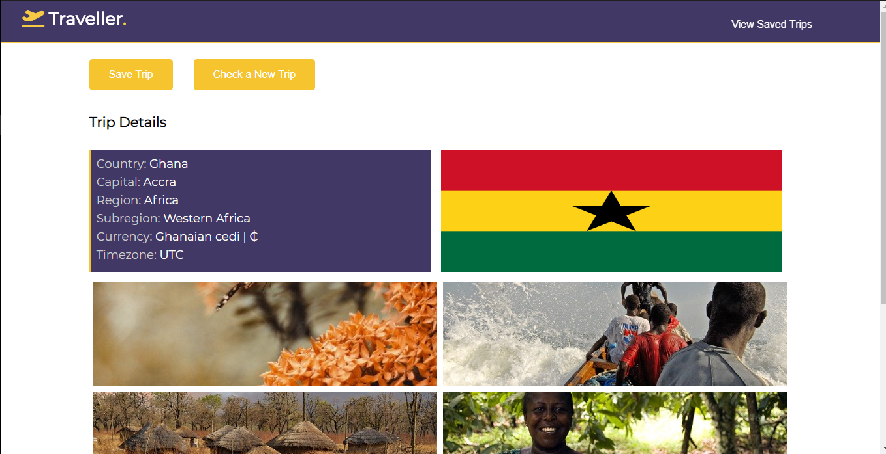
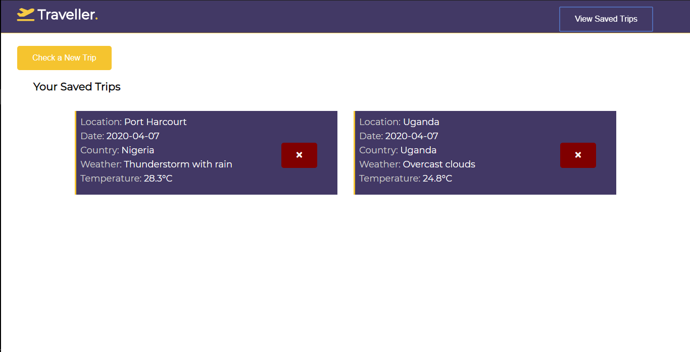

### project description
 - This is a travel app that provides travellers weather information about their destination location
 - this app provies it users with the following information
 - `Weather forcast` `country details` `pictures` and `flag`

### screenshots

### Tools used
 - Node & Express
 - 3rd party API
 - webpack
 - babel
 - JavaScript
 - html
 - scss
 - service walker
 - Jest

### 3rd party API's used
 - [Geonames](https://www.geonames.org/export/geonames-search.html)
 - [WeatherBit](https://www.weatherbit.io/api)
 - [Pixabay](https://pixabay.com/api/docs)
 - [Rest Countries](http://restcountries.eu/)

### steps needed to setup project
 - clone this repository `git clone http://github.com/oliver-ke/Traveller`
 - install dependencies `npm install`
 - Run a production build using `npm run build`
 - start the server using `npm run start`
 - open your browser and navigate to `http://localhost:5000`
 - You should see the app

### Added features
 - Use Local Storage to save the data so that when they close, then revisit the page, their information is still there
 - Users will get weather forcast for multiple days
 - Integrate the REST Countries API to pull in data for the country being visited
 - Allow the user to remove the trip
 - Incorporate icons into forecast

### Student
 - `name:` Azorji Kelechi Oliver
 - `Course:` Udacity frontend course
 - `Date:` 05/04/2020

#### @2020 Udacity frontend course
